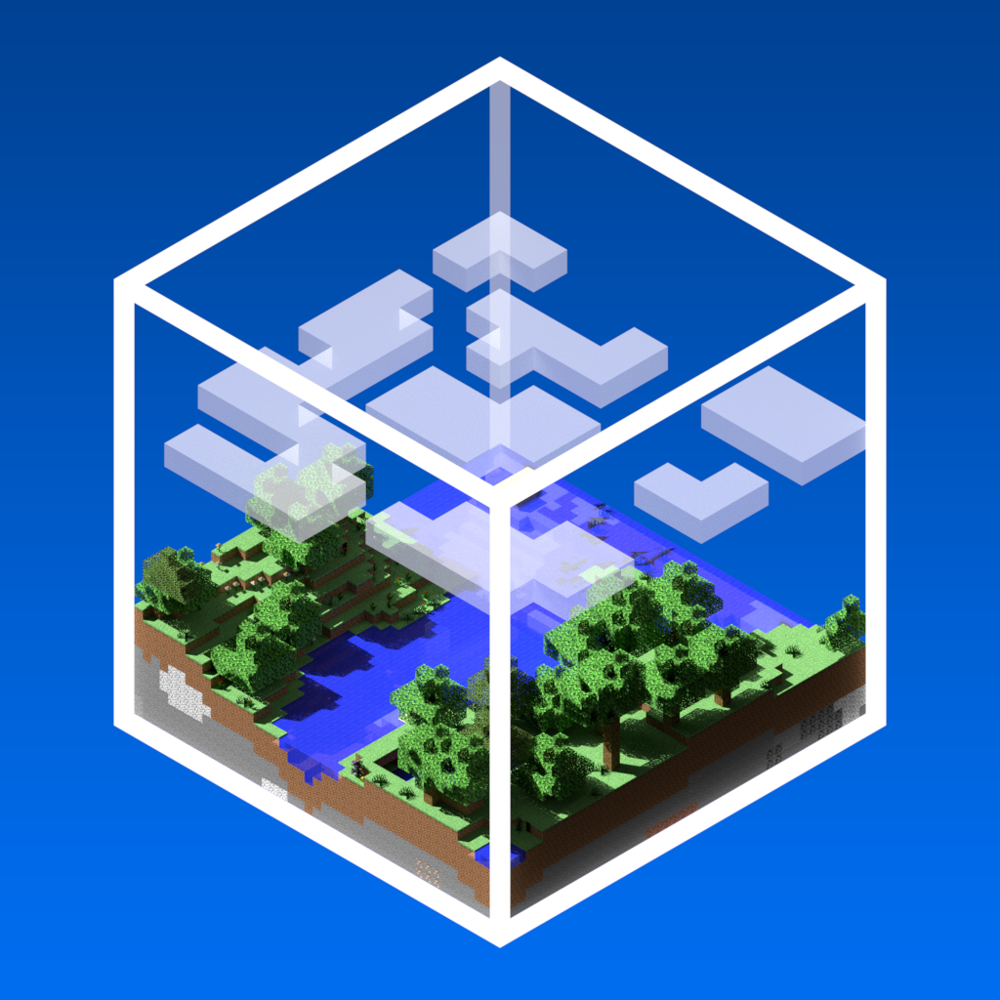

# Nuit

A custom skybox engine for Minecraft resource packs and mods.

Nuit is the successor to FabricSkyBoxes. It provides a JSON-driven skybox format with keyframe fades, rotation, conditions, fog control, decorations, animated textures, and support for both Fabric and NeoForge.

[Wiki and format documentation](https://wiki.nuit.flashyreese.me/) | [Legacy documentation](https://github.com/FlashyReese/nuit/tree/1.21.8/dev/docs) | [GitHub](https://github.com/FlashyReese/nuit)

Logo by [UsernameGeri](https://github.com/UsernameGeri).

## Status

Nuit is currently in beta. The format and API are stable enough for resource-pack development, but some behavior may still evolve before a final 1.0.0 release.

Current development target: Minecraft 1.21.11.

Supported loaders:

- Fabric
- NeoForge

## Features

- JSON-based custom skybox format
- Keyframeable fade and rotation
- Biome, dimension, weather, height, position, and world conditions
- Custom fog color and density behavior
- Vanilla overworld/end skybox integration
- Square textured, multi-textured, monocolor, and decoration skyboxes
- Animated texture support with optional frame interpolation
- Runtime API for mods to register and manage skyboxes
- Multiloader architecture for Fabric and NeoForge

## Showcase

### [Hyper Realistic Sky](https://www.curseforge.com/minecraft/texture-packs/hyper-realistic-skybox-sun-moon-clouds) by [UsernameGeri](https://modrinth.com/user/UsernameGeri)

### [Awesome Skies](https://www.curseforge.com/minecraft/texture-packs/awesome-skies) by [heyman](https://github.com/heymanMC)

### [Kal's Grimdark Sky Pack](https://www.curseforge.com/minecraft/texture-packs/grimdark-sky) by [Kalam0n](https://legacy.curseforge.com/members/kalam0n)

## Skybox Format

Nuit uses its own JSON format instead of copying OptiFine or MCPatcher directly. The format is designed around explicit skybox types, composable conditions, and predictable behavior across loaders.

Start here:

- [Current schema reference](docs/schema.md)
- [Blend modes](docs/blend.md)
- [Square textured layout](docs/square-textured.md)
- [Wiki and format documentation](https://wiki.nuit.flashyreese.me/)

## Compatibility

Nuit does not load OptiFine, MCPatcher, or legacy FabricSkyBoxes formats natively.

Use [Nuit Interop](https://modrinth.com/nuit-interop) if you want to load legacy custom sky resource packs through Nuit. Nuit Interop supports MCPatcher/OptiFine custom skies and legacy FabricSkyBoxes skybox JSON.

## For Mod Developers

Nuit exposes an API for registering custom skybox types and managing skyboxes at runtime. See [docs/api.md](docs/api.md).

Use `NuitApi.registerSkyboxType(...)` as the documented skybox type registration path.

## Community and Support

- [Issue tracker](https://github.com/FlashyReese/nuit/issues)
- [Discord](https://flashyreese.me/discord)

## License

Nuit is licensed under MIT. See [LICENSE](LICENSE) for details.
